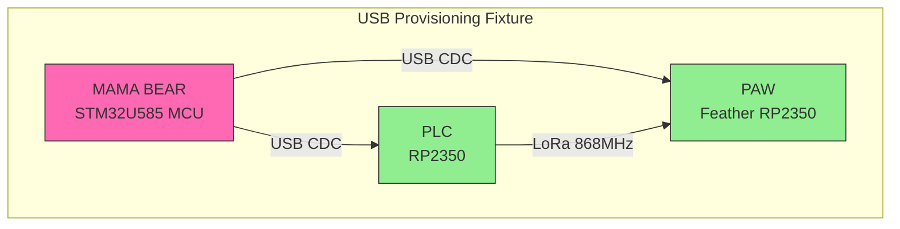
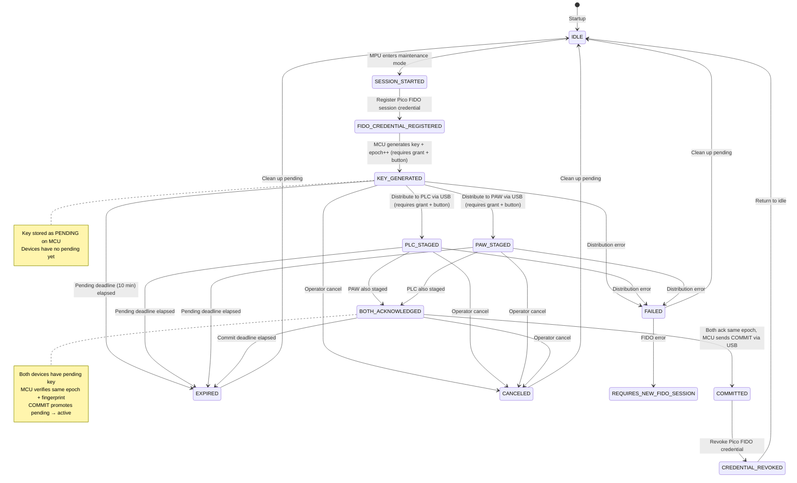

# Systemarkitektur — SHALLOT

> Status: Uppdaterad 2026-09-07 | Vecka: 3 | Linear: PRO-31 + PRO-45 + PRO-46
>
> **Notering PRO-42 (2026-09-07):** V2-provisioneringsprotokollet (AES-128-GCM key envelope) är under säkerhetsgranskning. Se `docs/16-provisioning-v2-security-design.md`. V2-protokollets format, envelope-struktur och kryptokonstruktion får INTE dokumenteras som implementerat förrän säkerhetsgranskningen är godkänd och KAT-tester passerar på alla tre mål. Nuvarande produktionskod använder V1 (klartext nyckel-data frame).

## 1. Oeversikt

Systemet bestaar av tre noder:

| Nod | Haardvara | Roll |
|-----|---------|------|
| PAW (Portable Authentication Wearable) | Adafruit Feather RP2350 + Core1262 + e-Paper | Baerbar ID-bricka, skickar autentiseringsbegaran |
| Edge enforcement-nod | Raspberry Pi Pico 2 (RP2350A) + Core1262 | Verifierar autentisering, fattar fail-closed-beslut |
| Air-gapped provisioneringshubb (Mama Bear) | Arduino UNO Q | Genererar och distribuerar AES-128-nycklar via USB (single source of truth) |

> **Beslut 2026-09-04 - USB istället för UART:** Alla tidigare referenser till UART (Serial1, D0/D1) för nyckeldistribution är föråldrade. Nyckeldistribution sker nu **enbart via USB** (USB CDC). Alla tre noder ansluts via USB-hubb. Detta beslut ersätter UART-arkitekturen fullständigt.

## 2. Databussdiagram



## 3. Kommunikation

Delade definitioner: `libraries/ShallotLoRa` (protokolltyper, ramformat,
timeouts, validatorer) och `libraries/ShallotEpd` (displaydrivrutin).
CI bygger alla tre firmware med explicita kaernor och bibliotek.

### 3.1 USB Provisioning Protocol

**Transport:** USB CDC via passive hub (MCU ↔ Devices). **USB aer den
enda provisioneringsvaegen:** produktionsfirmware anropar aldrig Serial1
foer nyckeltrafik (ett oanvänt `Serial1.begin` kvarstaar i UNO Q).
UART-referenser (Serial1, D0/D1) aer foeraaldrade sedan 2026-09-04.

| Message | Direction | Format | Size | Description |
|---------|-----------|--------|------|-------------|
| Handshake | MCU → Device | `0xA1 + target_id + epoch_be4 + seq` | 7B | Initiate key distribution, retry counter |
| Ready | Device → MCU | `0xA2 + device_id[4] + epoch_be4` | 9B | Device acknowledges, echoes epoch |
| Key Data | MCU → Device | `0xA3 + len + key[16] + crc32 + epoch_be4 + seq` | 27B | Pending key with CRC, epoch and seq |
| Stored | Device → MCU | `0xA4 + hash[4] + epoch_be4` | 9B | Device confirms storage with fingerprint |
| Commit | MCU → Device | `0xA6 + target_id + epoch_be4` | 6B | Activate pending → active key |
| Cancel | MCU → Device | `0xA7 + target_id + epoch_be4` | 6B | Discard pending key |
| Error | Device → MCU | `0xA5` | 1B | Distribution failed |

**CRC32:** Accidental corruption check only (not authentication).
Enforced on every staging path, including idempotent resends.
**Epoch:** 4-byte big-endian session ID for the provisioning round,
monotonically increasing (rollback protection).
**Seq:** 1-byte retry counter within the round. Repeats with matching
(epoch, seq) are answered idempotently (READY/STORED resending) instead
of starting new rounds — this is how duplicates are handled.
**Retries (fail-closed on exhaustion):** handshake 3x (seq++), key-data
3x (same seq), COMMIT-ACK 2x. No key is sent unless identity + READY
succeeded for the round.
**Resync:** tag-anchored reads with bounded stray-byte skipping recover
from broken/partial messages; validation failures resume scanning
instead of aborting the round.
**Target IDs:** PLC = 0x01, PAW = 0x02.

### 3.2 LoRa P2P Authentication Protocol (868 MHz)

| Message | Direction | Format | Size | Description |
|---------|-----------|--------|------|-------------|
| Challenge | PLC → PAW | `0xB1 + nonce[16] + epoch_be4` | 21B | Fresh challenge with epoch context |
| Response | PAW → PLC | `0xB2 + nonce[16] + epoch_be4 + hmac[32]` | 53B | HMAC-SHA256(key, epoch\|\|nonce) |
| Result | PLC → PAW | `0xB3 + result(0x01/0x00)` | 2B | Auth success/failure |

**HMAC Input:** `HMAC-SHA256(key, epoch_be4 || nonce)` (20 bytes) — binds
response to epoch and challenge. Implemented identically on both sides.
**Replay Protection:** PLC maintains nonce cache (last 16 nonces, 60s window);
repeats are rejected, as are responses with no live challenge.
**RSSI Gate:** PLC discards packets with RSSI < -70 dBm (fail-closed).
**Timeouts/retries:** response timeout 30 s with re-issue; 5 consecutive
failures (timeout or failed verification) enter 60 s lockout with no
transmissions; a verified success resets the budget. No key on PLC/PAW
means no challenges are sent at all.

## 4. State Machine — Key Rotation



**Epoch Management:**
- `activeEpoch`: Currently active operational key
- `pendingEpoch`: Next epoch being staged (activeEpoch + 1)
- `pendingDeadlineMs`: 10-minute window for staging both devices
- **Rollback Protection:** Epoch must be monotonically increasing

## 5. Fail-closed-princip

Inget godkaennande utan full verifierad kedja; ingen nyckel i SRAM efter
(om)start. Utlösare foer NEKA (deny-by-default) i implementationen:

- Svag RSSI (< -70 dBm) — paket droppas
- Ogiltig HMAC eller fel nonce/epoch i LoRa-svar
- Replay/dubblett (nonce-cache, seq-dubbletter, svar utan live challenge)
- Challenge-timeout (30 s), 5 fel i rad → 60 s lockout utan saendning
- CRC-fel eller degenererad (noll/uniform) nyckel stageas aldrig
- Stale epoch (rollback-skydd), ofullstaendig runda (ingen commit utan
  baegge ack + matchande hash/epoch), passerad 10-minutersdeadline
- Saknad nyckel: PLC saender inga challenges; PAW besvarar inga
- WDT-reboot eller stroemboertfall: tom SRAM, oautentiserad boot,
  omprovisionering med ny epoch kraevs
- Saknad/utgaangen grant eller ej frasch knapptryckning (MPU/MCU)

## 6. Security Boundaries

### 6.1 Trust Model

```
┌─────────────────────────────────────────────────────────────┐
│                    TRUSTED COMPUTE BASE                       │
│  ┌─────────────────────┐                                    │
│  │  STM32U585 MCU      │  ◄── Key Generation (TRNG)         │
│  │  (UNO Q)            │  ◄── Grant Verification            │
│  │                     │  ◄── Epoch State Management         │
│  │                     │  ◄── Button Edge Detection          │
│  └─────────────────────┘                                    │
│         ▲                                                     │
│         │ USB CDC (Key Material)                             │
│         ▼                                                     │
│  ┌─────────────────────────────────────────────────────┐   │
│  │              UNTRUSTED ORCHESTRATION                 │   │
│  │  Qualcomm QRB2210 MPU (Linux)                         │   │
│  │  - Bridge RPC coordination                           │   │
│  │  - FIDO2/WebAuthn session management                 │   │
│  │  - USB device detection                               │   │
│  │  - Audit logging (NO KEY MATERIAL)                    │   │
│  └─────────────────────────────────────────────────────┘   │
└─────────────────────────────────────────────────────────────┘
        ▲           ▲
        │ USB       │ USB
        ▼           ▼
┌──────────────┐ ┌──────────────┐
│    PLC        │ │    PAW        │
│  (RP2350)     │ │ (Feather RP2350)│
└──────────────┘ └──────────────┘
        ▲           ▲
        └─── LoRa P2P ───┘
```

### 6.2 Threat Model (Updated 2026-09-04)

**In Scope:**
- ✅ Remote attackers (network-based)
- ✅ Casual or brief unsupervised physical access
- ✅ Replay attacks (LoRa messages, grant tokens)
- ✅ Spoofing attacks (device identity, FIDO assertions)
- ✅ Accidental key rotation (missing button, wrong grant)
- ✅ Cloned device identifiers (mitigated by challenge-response)
- ✅ Compromised MPU-side orchestration (MCU still enforces)
- ✅ USB transport security (epoch binding, hash verification)

**Out of Scope (Prototype):**
- ❌ Invasive chip extraction
- ❌ Theft-grade hardware forensics
- ❌ Tamper-evident enclosure design
- ❌ Sophisticated side-channel attacks
- ❌ Supply chain attacks on hardware

**Defence in Depth:**
1. **Physical:** Button edge detection prevents accidental/forced authorization
2. **Cryptographic:** One-time grants, HMAC, epoch binding, FIDO2 UP requirement
3. **Protocol:** USB message integrity (CRC), LoRa replay protection, RSSI gating
4. **Temporal:** Grant expiry (60s), pending window (10min), nonce cache
5. **Audit:** Complete logging of operations without secrets
6. **Separation:** MPU never sees key material, MCU is single source of truth

**Remaining Limitations (Prototype):**
- USB hub is passive (no cryptographic protection)
- Epoch stored in RAM only (power loss resets to 0)
- Keys stored in volatile SRAM (power loss = fail-closed but requires re-provisioning)
- No permanent device identity keys yet (slice 4)
- No production firmware signing yet
- FIDO2 implementation uses placeholder (slice 3)
