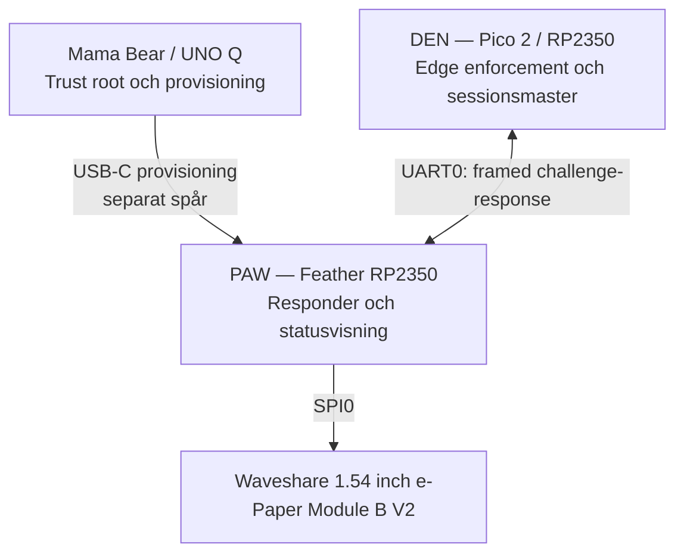
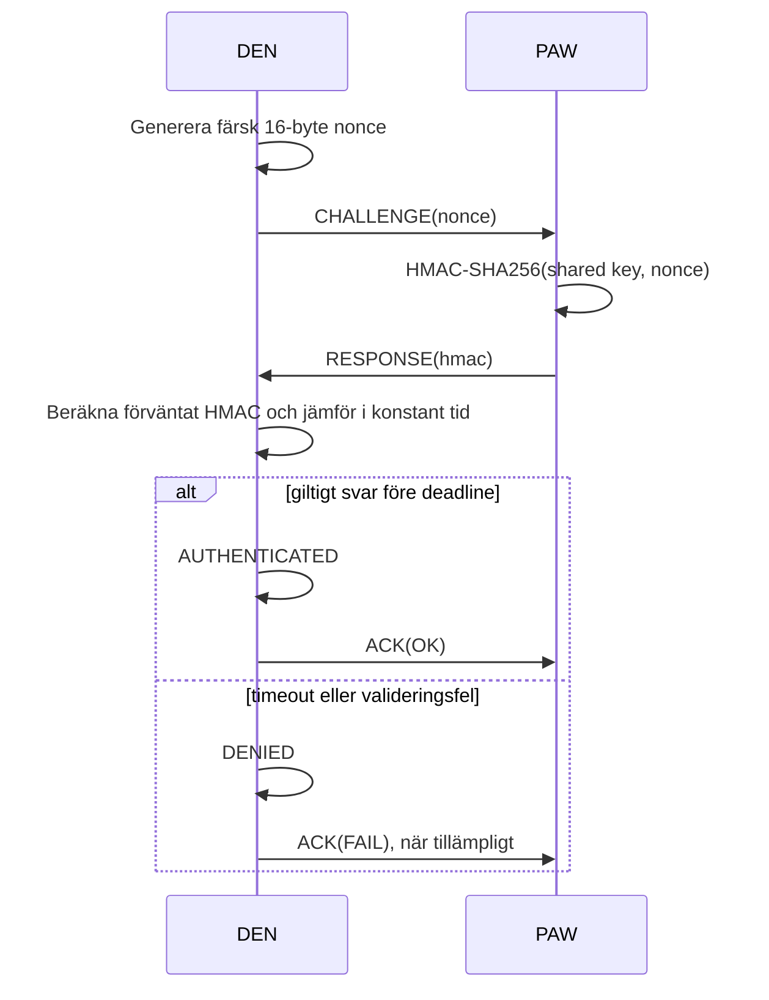

# 02 — Arkitektur

| Fält | Värde |
|------|-------|
| Dokument | 02 — Arkitektur |
| Version | 3.0 |
| Status | Aktiv |
| Datum | 2026-09-11 |
| Ansvarig | Johannes Olerås |
| Linear | PRO-83 |

---

## 1. Inledning

Detta dokument beskriver SHALLOT:s aktuella arkitektur efter pivoten den 9 september 2026. DEN och PAW autentiserar varandra över fysisk UART-dockning. LoRa ingår inte i den kritiska autentiseringsvägen och är ett separat, fryst framtida larmspår.

Systemet använder challenge-response med HMAC-SHA256. Fysisk kontakt gör transporten deterministisk, men är inte i sig ett identitetsbevis. Identiteten verifieras kryptografiskt och DEN fattar alltid ett fail-closed accessbeslut.

## 2. Designprinciper

1. **Explicit verifiering:** PAW blir inte betrodd bara för att den är dockad. Varje session kräver ny challenge och giltigt HMAC-svar.
2. **Fail-closed:** Timeout, fel CRC, fel ramtyp/-längd, HMAC mismatch, frånkoppling eller osäkerhet ger nekad åtkomst.
3. **Defence in Depth:** Fysisk kontakt, korrekt UART-koppling, ramvalidering, CRC32, HMAC, konstant tidsjämförelse och state machine kompletterar varandra.
4. **Separerade transporter:** USB-C används för provisioning. `Serial1` används exklusivt för DEN↔PAW-dockning.
5. **Responsiv säkerhetsväg:** E-paper och provisioning får inte blockera dock-autentiseringens tvåsekundersdeadline.
6. **Minsta privilegium:** DEN initierar och fattar accessbeslut. PAW är responder-only och initierar aldrig en dockningssession.

## 3. Systemöversikt



### 3.1 Roller

| Komponent | Ansvar | Säkerhetsansvar |
|---|---|---|
| Mama Bear MCU | Genererar och förvaltar operationsnyckel | Trust root och fysisk auktorisering av provisioning |
| Mama Bear MPU | Orkestrering, audit och framtida USB-transport | Ska inte hantera rå operationsnyckel i målarkitekturen |
| DEN | Skickar challenge, verifierar HMAC, fattar beslut | Default deny och fail-closed state machine |
| PAW | Tar emot challenge och skickar response | Responder-only, skyddar lokal nyckel och visar status |

## 4. Fysisk UART-dockning

| Signal | DEN Pico 2 | PAW Feather RP2350 | Koppling |
|---|---|---|---|
| UART TX | GP0 | RX / GPIO1 | DEN GP0 → PAW RX |
| UART RX | GP1 | TX / GPIO0 | DEN GP1 ← PAW TX |
| Referens | GND | GND | GND ↔ GND |

Båda sidor kör 3,3 V-logik. TX och RX måste vara korsade, och gemensam jord krävs för en stabil elektrisk referens.

### 4.1 UART-respons

UART vid 115200 baud är känsligare än en lågfrequent kontinuitetsmätning. Ett lyckat loopback-test visar lokal UART-funktion, medan en lyckad challenge-response-session dessutom visar korrekt korsad koppling, protokoll, HMAC och nyckelmatchning.

## 5. Kontaktprotokoll

UART är en byteström och kräver ett eget ramformat:

```text
SYNC | LENGTH | TYPE | PAYLOAD | CRC32
0xAA | uint16 | uint8| N bytes | uint32
```

- LENGTH är little-endian och anger payloadens längd.
- CRC32 beräknas över LENGTH + TYPE + PAYLOAD.
- Max payload är 64 byte.
- Parsern hanterar delramar, byte-timeout, felaktig CRC, resynkronisering och längdgränser utan obegränsad blockering.

| Typ | Kod | Riktning | Payload |
|---|---:|---|---|
| CHALLENGE | `0x01` | DEN → PAW | nonce, 16 byte |
| RESPONSE | `0x02` | PAW → DEN | HMAC-SHA256, 32 byte |
| ACK | `0xFF` | båda riktningar | status, 1 byte |

HEARTBEAT och ALARM är reserverade protokolltyper; de är inte del av aktuell UART-autentisering.

## 6. Challenge-response och accessbeslut



DEN använder tre tillstånd:

| Tillstånd | Betydelse |
|---|---|
| DENIED | Standardläge efter boot, reset, fel, timeout eller frånkoppling |
| CHALLENGE_SENT | DEN väntar på exakt ett giltigt RESPONSE för aktuell nonce |
| AUTHENTICATED | Giltigt RESPONSE har verifierats inom deadline |

Deadline är två sekunder från sänd CHALLENGE. Ett tidigare lyckat resultat får aldrig auktorisera en senare misslyckad eller utebliven session. ACK är informativt och ändrar inte DEN:s interna beslut.

## 7. PAW:s programflöde och e-paper

PAW prioriterar dock-UART i varje loopvarv. E-paper och USB-provisionering körs som begränsade polling-state-machines.

```text
1. Poll dock-UART / hantera CHALLENGE
2. Poll e-paper-uppdatering
3. Poll USB-provisionering
4. Återgå omedelbart till dock-UART
```

Displayen är Waveshare 1.54 inch e-Paper Module (B) V2 på SPI0:

| Signal | Feather-pin | GPIO |
|---|---|---:|
| DIN / MOSI | MO | 23 |
| CLK / SCK | SCK | 22 |
| CS | D5 | 5 |
| DC | A0 | 26 |
| RST | A1 | 27 |
| BUSY | A3 | 29 |

Om panelen saknas eller BUSY fastnar går PAW till degraderat displayläge. Dock-autentisering fortsätter; användargränssnittet får aldrig blockera autentisering.

## 8. Provisioning och nyckellivscykel

### 8.1 Aktuellt läge

UART-dockningen är hårdvaruverifierad med development key. USB-C-provisioneringens produktionsarkitektur är ett separat hardening-spår och är inte ett beroende för den verifierade dock-autentiseringen.

### 8.2 Målarkitektur

- Mama Bear är trust root.
- PAW provisioning använder USB-C/USB `Serial`.
- DEN↔PAW dockning använder `Serial1`; provisioning får inte läsa eller konsumera dock-UART.
- MPU ska i målarkitekturen vara en relay för offentliga värden och ciphertext, inte rå operationsnyckel.
- Device-identity/wrapped-key-provisioning är designat men inte produktionsaktiverat.

## 9. Hotmodell och kvarstående risker

| Händelse eller angrepp | Hantering | Kvarstående risk |
|---|---|---|
| Kabelbrus eller bitfel | CRC32, maxlängd och parserresynk | Kan skapa denial-of-service |
| Uteblivet PAW-svar | Tvåsekundersdeadline och DENIED | Tillgänglighet påverkas |
| Replay av gammalt svar | Färsk nonce varje session | Kräver korrekt slumpkälla |
| Förfalskat svar utan nyckel | HMAC-SHA256 och konstant tidsjämförelse | Giltig komprometterad nyckel är fortfarande risk |
| Död display | Degraderat, icke-blockerande läge | Visuell UX saknas |
| Fysisk kompromettering | Avgränsad och dokumenterad residual risk | RP2350 saknar secure element i prototypen |

## 10. Scope

### I scope

- Kontaktbaserad UART-dockning mellan DEN och PAW.
- Framed challenge-response, HMAC och fail-closed accessbeslut.
- Icke-blockerande PAW-firmware.
- Testbarhet med protokollvektorer, enhetstester och bänkresultat.

### Utanför aktuellt scope

- LoRa-felsökning och LoRa som autentiseringstransport.
- LoRa TX-only larmkanal och cover traffic.
- Produktionsaktivering av wrapped-key/device-identity-provisioning.
- Secure element för PAW:s långsiktiga identitetsnyckel.

## 11. Verifieringsstatus

| Område | Status |
|---|---|
| UART frame protocol | Dokumenterat och testat |
| DEN challenge/verification | Implementerat och testat |
| PAW responder | Implementerat och testat |
| UART hardware integration | Verifierad på bänk med lyckade och negativa fall |
| Fail-closed watchdog | Implementerat och testat; väntar på separat reviewbar merge |
| E-paper B V2 | Visuellt verifierad; hålls icke-blockerande |
| USB-C production provisioning | Design/hardening-spår, ej aktiverat |
| LoRa larmkanal | Fryst, ej i aktuell autentiseringsväg |

## 12. Historik

| Version | Datum | Ändring |
|---|---|---|
| 1.0 | 2026-09-04 | Första utkast |
| 2.0 | 2026-09-07 | LoRa-centrerad implementation |
| 3.0 | 2026-09-11 | Omskriven för kontaktbaserad UART-pivot; LoRa bort från autentiseringsvägen |
