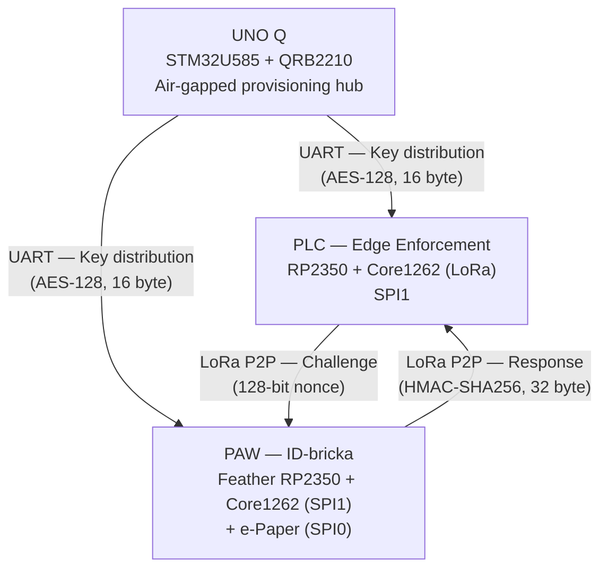
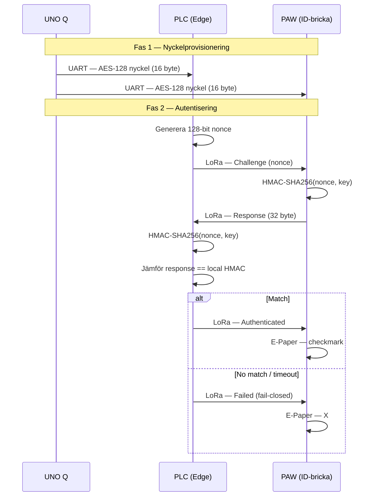
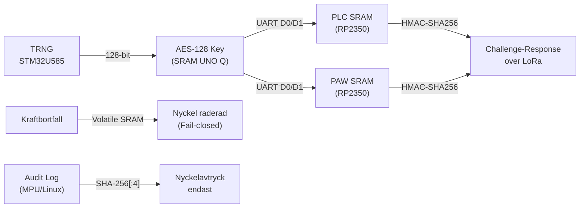
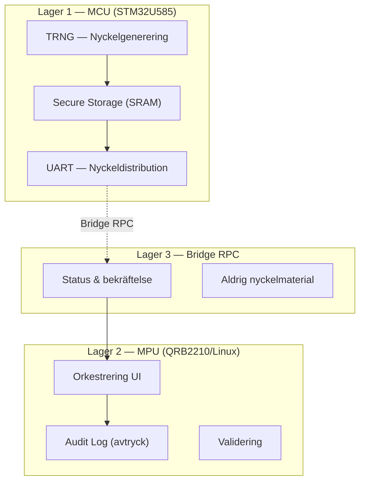
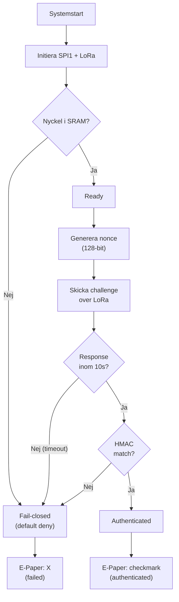

# 02 — Arkitektur

| Fält | Värde |
|------|-------|
| Dokument | 02 — Arkitektur |
| Version | 2.0 |
| Status | Aktiv |
| Datum | 2026-09-07 |
| Ansvarig | Johannes Olerås |
| Linear | PRO-31 |

---

## 1. Inledning

Detta dokument beskriver systemarkitekturen för SHALLOT — ett säkert-och-designat ID-bricka-autentiseringssystem. Arkitekturen baseras på faktisk implementation i firmware för UNO Q, PLC (edge enforcement-nod) och PAW (ID-bricka).

### 1.1 Designprinciper

1. **Air-gap:** UNO Q har inget aktivt nätverksinterface. Nyckelmaterial distribueras via UART (fysisk anslutning).
2. **Fail-closed:** Systemet nekar access (default deny) om validering misslyckas, uteblir eller om kommunikation fallerar.
3. **Säkerhet-und-design:** Defense-in-depth med separata SPI-bussar, SRAM-lagring av nycklar (volatilt), och audit log med endast nyckelavtryck.
4. **Sekretess:** E-Paper visar endast abstrakta statusikoner, aldrig text, namn eller roll.

---

## 2. Systemöversikt

### 2.1 Enhetsbeskrivningar

#### UNO Q (Provisioneringshubb)
- MCU: STM32U585 (Arduino UNO Q)
- MPU: QRB2210 (Linux, Arduino App Lab)
- Roll: Trust root — genererar AES-128-nycklar med TRNG
- Kommunikation: UART (Serial1 D0/D1) för nyckeldistribution
- Air-gap: Inget nätverksinterface aktivt
- Audit log: SHA-256[:4] avtryck endast, aldrig nyckelmaterial

#### PLC (Edge Enforcement Node)
- Hårdvara: Raspberry Pi Pico 2 (RP2350) + Waveshare Core1262 (SX1262 LoRa)
- Roll: Genererar nonce, skickar challenge, verifierar HMAC, fattar fail-closed-beslut
- SPI1: Core1262 LoRa (SCK=D10, MOSI=D11, MISO=D24, CS=D9, RST=GPIO4, BUSY=GPIO7, DIO1=A2/GPIO28)
- Nyckellagring: SRAM (volatilt — kraft bort = nyckel bort)
- Status: SPI bring-up bekräftad, LoRa RX/TX fungerar

#### PAW (ID-bricka)
- Hårdvara: Adafruit Feather RP2350 + Waveshare Core1262 (SPI1) + e-Paper Waveshare 1.54" V2 (SPI0)
- Roll: Tar emot challenge, beräknar HMAC, returnerar response, visar status
- SPI1: Core1262 LoRa (samma pin-konfiguration som PLC)
- SPI0: e-Paper (DIN=MO/GPIO23, CLK=SCK/GPIO22, CS=D5/GPIO5, DC=A0/GPIO26, RST=A1/GPIO27, BUSY=A3/GPIO29)
- Nyckellagring: SRAM (volatilt)
- Status: E-Paper-drivrutin implementerad, LoRa RX/TX fungerar

---

## 3. Kommunikationsflöde

---

## 4. Nyckellivscykel

### 4.1 Nyckelsäkerhet

| Egenskap | Implementering |
|----------|----------------|
| Generering | STM32U585 TRNG (hårdvaruentropi) |
| Längd | 128 bitar (AES-128) |
| Lagring | SRAM (volatilt) — aldrig beständigt minne |
| Distribution | UART (Serial1 D0/D1) — fysisk anslutning |
| Audit | SHA-256[:4] avtryck i MPU-logg, aldrig nyckel |
| Radering | Kraftbortfall raderar SRAM automatiskt |

---

## 5. UNO Q — Trelagersmodell

### 5.1 Lagerbeskrivningar

| Lager | Komponent | Ansvar | Rör nyckel? |
|-------|-----------|--------|-------------|
| 1 | MCU (STM32U585) | TRNG, nyckellagring, UART-distribution | Ja — genererar och distribuerar |
| 2 | MPU (QRB2210/Linux) | UI, audit log, validering | Nej — endast avtryck |
| 3 | Bridge RPC | Status och bekräftelsemeddelanden | Nej — bär aldrig nyckel |

Bridge RPC-bibliotek: `Bridge.begin()`, `Bridge.call()`, `Bridge.notify()`, `Bridge.provide()`, `Bridge.provide_safe()`

---

## 6. Pin-konfiguration

### 6.1 PLC — Core1262 LoRa (SPI1)

| Signal | Pin | GPIO | Funktion |
|--------|-----|------|---------|
| SCK | D10 | GPIO10 | SPI1 SCK (hardware) |
| MOSI | D11 | GPIO11 | SPI1 MOSI (hardware) |
| MISO | D24 | GPIO24 | SPI1 MISO (hardware) |
| CS | D9 | GPIO9 | SPI1 CS (manual digitalWrite) |
| RESET | pin 4 | GPIO4 | Digital output |
| BUSY | pin 7 | GPIO7 | Digital input |
| DIO1 | A2 | GPIO28 | Digital input/interrupt |

### 6.2 PAW — Core1262 LoRa (SPI1)

Samma konfiguration som PLC (se 6.1).

### 6.3 PAW — e-Paper Waveshare 1.54" V2 (SPI0)

| Signal | Pin | GPIO | Funktion |
|--------|-----|------|---------|
| DIN (MOSI) | MO | GPIO23 | SPI0 MOSI |
| CLK | SCK | GPIO22 | SPI0 SCK |
| CS | D5 | GPIO5 | Manual digitalWrite |
| DC | A0 | GPIO26 | Digital output |
| RST | A1 | GPIO27 | Digital output |
| BUSY | A3 | GPIO29 | Digital input |

### 6.4 Kritisk varning

GPIO4 är SPI0 MISO, INTE SPI1 MISO. `SPI1.setRX(4)` orsakar runtime panic. Giltiga SPI1 MISO-pinnar: 8, 12, 24, 28 (endast 24 och 28 är på headers; 28 används för DIO1). GPIO8 är PSRAM chip select ("PCS"), inte åtkomlig på standardheaders.

---

## 7. Fail-closed-beteende

### 7.1 Fail-closed-scenarier

| Scenario | Resultat | Orsak |
|----------|----------|-------|
| PAW svarar inte inom 10s | Neka access | Watchdog-timeout |
| HMAC matchar inte | Neka access | Nyckel felaktig eller manipulation |
| Nyckel saknas i SRAM | Neka access | Kraftbortfall har raderat nyckel |
| LoRa-kommunikation fallerar | Neka access | Paketförlust eller interferens |
| Systemstart | Neka access | Default deny innan initiering |

---

## 8. E-Paper-statusvisning

### 8.1 Statuslagar

| Status | Ikon | Beskrivning |
|--------|------|-------------|
| Authenticating | Tre punkter (.) | Väntar på response |
| Authenticated | Cirkel + checkmark | HMAC matchar |
| Failed (fail-closed) | Cirkel + X | Nekad access |
| Blank | Tom skärm | Viloläge |

### 8.2 Tekniska detaljer

- Display: Waveshare 1.54" e-Paper V2, 200x200, Svart/Vit
- SPI Mode 0, full refresh (~2s med flicker, normalt enligt manual)
- Sleep mode efter varje uppdatering (säkerhetskrav — förhindrar högspanningsskada)
- `begin()` måste anropas efter `sleep()` före varje refresh
- Drivrutin anpassad från Waveshare epd1in54_V2 (MIT-licensierad)
- Framebuffer med ritprimitiver: pixel, line, rect, circle

---

## 9. Byggmiljö

| Enhet | Verktyg | Core/Bibliotek |
|-------|---------|-----------------|
| UNO Q (MCU) | Arduino IDE 2.x | ArduinoCore-zephyr |
| UNO Q (MPU) | Arduino App Lab | Python (QRB2210/Linux) |
| PLC | Arduino IDE 2.x | arduino-pico core |
| PAW | Arduino IDE 2.x / PlatformIO | arduino-pico core |
| LoRa | RadioLib | SPI1 via arduino-pico |

---

## 10. Firmware-översikt

| Katalog | Fil | Enhet | Linear | Status |
|---------|-----|-------|--------|--------|
| key-authority/uno-q-key-authority-mcu/ | uno-q-key-authority-mcu.ino | UNO Q MCU | PRO-45/46 | Implementerad |
| key-authority/uno-q-key-authority-mpu/ | uno-q-key-authority-mpu.py | UNO Q MPU | PRO-45/46 | Implementerad |
| plc/plc-key-receiver/ | plc-key-receiver.ino | PLC | PRO-47 | Implementerad |
| id-kort/paw-key-receiver/ | paw-key-receiver.ino | PAW | PRO-48 | Implementerad |
| plc/spi-bringup-test/ | spi-bringup-test.ino | PLC | PRO-27 | Implementerad |
| id-kort/spi-bringup-test-core1262/ | spi-bringup-test-core1262.ino | PAW | PRO-28 | Implementerad |
| id-kort/spi-bringup-test-epaper/ | spi-bringup-test-epaper.ino | PAW | PRO-29 | Implementerad |
| id-kort/epaper-status-display/ | epaper-status-display.ino | PAW | PRO-57 | Implementerad |
| id-kort/paw-main/ | paw-main.ino | PAW | — | Implementerad |
| (ej implementerad) | — | PLC | PRO-49/51/52/53 | Avgränsning |
| (ej implementerad) | — | PAW | PRO-50/52 | Avgränsning |

---

## 11. Protokollspecifikation (översikt)

Detaljerad protokollspecifikation kommer i dokument 05. Översikt:

### 11.1 Paketstruktur (planerad)

| Typ | Innehåll | Storlek | Riktning |
|-----|----------|---------|---------|
| Challenge | Nonce (128-bit) + typ | ~18 byte | PLC -> PAW |
| Response | HMAC-SHA256 (32 byte) + typ | ~34 byte | PAW -> PLC |
| Status | Authenticated / Failed + typ | ~2 byte | PLC -> PAW |

### 11.2 LoRa-parametrar

Exakta parametrar (frekvens, bandbredd, spreading factor) dokumenteras i 06-radio-parametrar (PRO-43, avgränsning).

---

## 12. Framtida utökning

### 12.1 NFC/RFID + Knappsats

Planerad utökning för tvåfaktor-autentisering på PAW eller separat enhet (ESP32-S3-Nano):

- NFC/RFID-läsare (RC522 eller PN532) bevarar air-gap genom fysisk närvaro (1-10 cm)
- Knappsats (3x4 matris) för PIN-kod
- Kombination RFID UID + PIN + HMAC-challenge ger tresfaktor-autentisering
- Status: Ej implementerad (avgränsning AL-008, AL-009)

### 12.2 Säkerhetsanalys

Säkerhetsdesign och hotmodellering dokumenteras i 07-sakerhetsdesign (PRO-54) och 08-hotmodellering (PRO-55).

---

## 13. Historik

| Version | Datum | Ändring |
|---------|-------|---------|
| 1.0 | 2026-09-04 | Första utkast |
| 2.0 | 2026-09-07 | Omskriven utifrån faktisk implementation. Mermaid-diagram tillagda. Pin-konfiguration verifierad. Firmware-översikt med spårbarhet. Fail-closed-flöde dokumenterat. |
