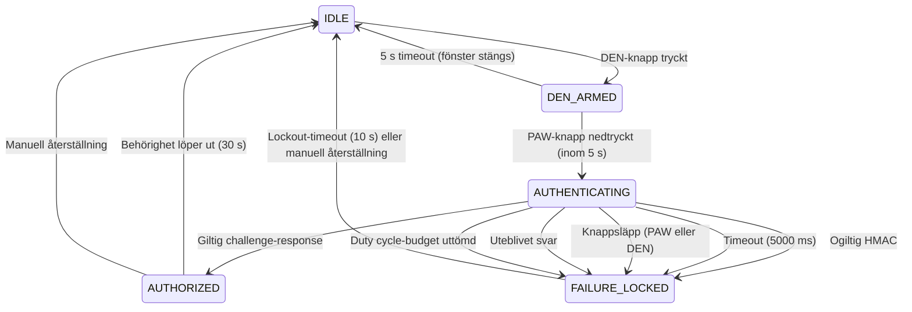

# 05 — Protokollspecifikation

**PRO-42** | SHALLOT challenge-response-protokoll över LoRa P2P
**Protokollversion:** 1
**Status:** Implementerat (Phase 1, stub-nyckel)

---

## 1. Översikt

Detta protokoll definierar binär paketstruktur för autentisering mellan edge enforcement-nod (PLC) och PAW (ID-bricka) över LoRa P2P. Protokollet använder HMAC-SHA256-utmaning-svar med AES-128-CTR-krypterad payload och fail-closed-arkitektur.

### Roller

| Roll                        | Hårdvara                            | Funktion                                                            |
| --------------------------- | ----------------------------------- | ------------------------------------------------------------------- |
| DEN (Edge Enforcement, PLC) | Pico 2 (RP2350) + Core1262          | Initierar challenge, verifierar response, fattar fail-closed beslut |
| PAW (ID-bricka)             | Feather RP2350 + Core1262 + e-Paper | Mottager challenge, returnerar krypterat svar, visar verdict        |
| UNO Q                       | STM32U585 (air-gapped)              | Provisionering: genererar och distribuerar master-nyckel via USB    |

### Beroenden

- PRO-81: Reviderat protokollformat (gällande designbeslut)
- PRO-78: LoRa-radio profil (868.1 MHz, SF7, BW125, CR4/5, 20 dBm)
- PRO-79: Protokollram och autentiseringsgräns (ersatt av PRO-81)
- PRO-45: Nyckelgenerering på UNO Q (Phase 2)

### Aktiveringsmodell

SHALLOT använder ett tvåhandsgrepp mellan DEN (edge enforcement-nod) och PAW (ID-bricka) för att säkerställa operatörsavsikt. LoRa är inaktiv utanför en explicit aktiveringscykel. Se avsnitt 5.4 för fullständig aktiveringsmodell och tillståndsmaskin.

---

## 2. Paketformat

Alla fält är i network byte order (big-endian) om inget annat anges.

| Offset | Fält                   | Storlek (byte) | Beskrivning                                      | HMAC-täckt |
| ------ | ---------------------- | -------------- | ------------------------------------------------ | ---------- |
| 0      | Version + Message Type | 1              | Version: bit 7–4, Message Type: bit 3–0          | Ja         |
| 1      | SenderID               | 8              | Sändarens unika identifierare                    | Ja         |
| 9      | Sequence Number        | 4              | Strikt ökande 32-bitars räknare per sändare      | Ja         |
| 13     | Nonce                  | 8              | 64-bitars kryptografiskt slump, unik per paket   | Ja         |
| 21     | Encrypted Payload      | N              | AES-128-CTR-krypterad nyttolast (0–64 byte)      | Ja         |
| 21+N   | HMAC-SHA256            | 8              | Trunkerad HMAC (första 8 byte av 32-byte digest) | Nej        |

N = payloadlängd i byte. Total paketstorlek = 21 + N + 8 byte.

- Header-längd: 21 byte (1 + 8 + 4 + 8)
- Minimipaket: 29 byte (header + HMAC, tom payload)
- Maximipaket: 93 byte (header + 64 byte payload + HMAC)

### 2.1 Fältbeskrivningar

**Version (4 bitar):** Protokollversion. Nuvarande version: 0x1. Inkluderas i HMAC för att förhindra versionsnedgraderingsattacker.

**Message Type (4 bitar):** Anger meddelandets semantiska typ. Inkluderas i HMAC för att förhindra meddelandemanipulation och state confusion.

| Värde | Typ       | Riktning       | Beskrivning                                           |
| ----- | --------- | -------------- | ----------------------------------------------------- |
| 0x01  | CHALLENGE | Edge till PAW  | Utmaning: nonce i header-fält, tom payload            |
| 0x02  | RESPONSE  | PAW till Edge  | Svar: krypterad challenge-nonce i payload             |
| 0x03  | SUCCESS   | Edge till PAW  | Autentisering lyckades, tom payload                   |
| 0x04  | FAILURE   | Edge till PAW  | Autentisering misslyckades (fail-closed), tom payload |
| 0x05  | KEY_DIST  | UNO Q till nod | Nyckeldistribution (via USB, ej LoRa)                 |
| 0x06  | KEY_ACK   | Nod till UNO Q | Bekräftelse på mottagen nyckel (via USB)              |
| 0x07  | HEARTBEAT | Edge till PAW  | Livstecken, underhåller sessionsstatus                |

**SenderID (8 byte):** Sändarens unika identifierare. Används av mottagaren för att slå upp förväntad nyckel och sekvensnummerfönster.

| Nod              | SenderID (hex)     |
| ---------------- | ------------------ |
| Edge Enforcement | 0x0100000000000000 |
| PAW              | 0x0200000000000000 |

**Sequence Number (4 byte):** 32-bitars strikt ökande räknare. Varje sändare upprätthåller en monoton ökande räknare (initierad till 0). Mottagaren sparar en sliding-window whitelist över de 10 senast mottagna sekvensnumren per SenderID och förkastar paket där sekvensnumret finns i whitelisten eller är lägre än det senast mottagna. Whitelist-storlek: 10 (enligt PRO-79/PRO-81 beslut 10). Förhindrar replay-attacker.

Nonce Tracking utelämnas uttryckligen. Sekvensnummer med whitelist (10) bedöms som tillräckligt för replay-skydd. Redundant och minneskrävande (PRO-81 beslut 10).

**Nonce (8 byte):** 64-bitars kryptografiskt slumpvärde genererat av sändaren för varje paket. Används tillsammans med Sequence Number för att garantera paketunlikhet och som IV-komponent för AES-CTR. Genereras med RP2350 hardware RNG (get_rand_128).

PRO-51 specificerar "Kryptografiskt säker nonce (128-bit)" = 16 byte. PRO-81 reducerar noncen till 8 byte. PRO-81 gäller; PRO-51 behöver uppdateras för att matcha.

**Encrypted Payload (N byte):** Nyttolast krypterad med AES-128 i CTR-läge. Längden varierar beroende på meddelandetyp. AES-CTR kräver ingen padding. Se avsnitt 4 för payload-struktur per meddelandetyp.

**HMAC-SHA256 (8 byte):** Trunkerad HMAC-SHA256-signatur. Beräknas över alla föregående fält (Version + Message Type + SenderID + Sequence Number + Nonce + Encrypted Payload) med K_mac som HMAC-nyckel. Signaturen trunkeras till de första 8 byte (64 bitar) av den fullständiga 32-byte digesten. Det egna fältet exkluderas från beräkningen.

---

## 3. Kryptografisk design

### 3.1 Nyckelmaterial och härledning

En 128-bit master-nyckel (16 byte) distribueras från UNO Q till både edge enforcement-nod och PAW via USB. Master-nyckeln exponeras aldrig för MPU eller nätverk.

Från master-nyckeln härleds två sub-nycklar via SHA-256 (PRO-81 beslut 8):

```
K_enc = SHA-256(master_key || "ENC")[:16]    -- för AES-128-CTR
K_mac = SHA-256(master_key || "MAC")[:16]    -- för HMAC-SHA256
```

Härledningen eliminerar nyckelåteranvändning: K_enc och K_mac är kryptografiskt oberoende. Implementationen använder RP2350 hardware SHA-256-accelerator (hw_sha256_start / hw_sha256_update / hw_sha256_finish).

**Phase 1:** Master-nyckel är en stub (0x00–0x0F). All kommunikation sker med härledda nycklar från denna stub.
**Phase 2:** Ersätt stub med riktig nyckel distribuerad av UNO Q (PRO-45, PRO-46).

### 3.2 AES-128-CTR-kryptering

Payload krypteras med AES-128 i CTR-läge. Keystream genereras genom AES-ECB-encryption av ett 128-bit counter-block:

```
Counter-block (16 byte):
  [0x00, 0x00, 0x00, 0x00]  -- 4 byte fast prefix
  [SeqNum (4 byte)]          -- big-endian
  [Nonce (8 byte)]           -- från paketets Nonce-fält
```

Block-counter inkrementeras i de två lägsta byten (counter[14:15]) för varje 16-byte block. Keystream XOR-as med plaintext/ciphertext. Operationen är symmetrisk — samma operation dekrypterar.

Implementationen använder AESLib.encryptSingle() för varje 16-byte block. AESLib tillhandahåller inte inbyggt CTR-läge; CTR-läget implementeras manuellt ovanpå ECB.

IV-konstruktionen överensstämmer med NIST SP 800-38A och RFC 3686. Restrisk vid omstart (sekvensnummer återställs till 0) dokumenteras i PRO-54 (säkerhetsdesign).

### 3.3 HMAC-SHA256

HMAC-SHA256 beräknas med K_mac som nyckel:

```
HMAC-SHA256(
  key = K_mac,
  message = Version_MsgType || SenderID || SequenceNumber || Nonce || EncryptedPayload
)
```

Resultatet trunkeras till första 8 byte. Trunkering till 64 bitar ger 2^-64 framgångssannolikhet för förfalskning per sändningsförsök. LoRa duty cycle-begränsningar (1% i EU ISM-bandet) gör offline-brute-force praktiskt omöjlig.

Implementationen använder RP2350 hardware SHA-256-accelerator för både inner- och outer hash. ipad/opad (64 byte vardera) prekalkyleras per anrop.

Jämförelse av mottagen och beräknad HMAC sker med konstant-tidsjämförelse (obligatoriskt implementationskrav, PRO-81 beslut 11) för att förhindra timing-attacker.

### 3.4 Anti-DoS: HMAC före sekvensnummerkonsumtion

HMAC verifieras INNAN sekvensnummer konsumeras i SeqWhitelist. Detta förhindrar en attackerare från att uttömma sekvensnummer-slots med skräppaket, eftersom endast paket med giltig HMAC konsumerar en plats i whitelisten. Paket med ogiltig HMAC kasseras omedelbart utan att påverka replay-fönstret.

---

## 4. Payload-struktur per meddelandetyp

### 4.1 CHALLENGE (0x01) — Edge till PAW

| Fält  | Storlek | Beskrivning                                         |
| ----- | ------- | --------------------------------------------------- |
| (tom) | 0 byte  | Challenge-nonce transporteras i header Nonce-fältet |

Payload-storlek: 0 byte. Total paketstorlek: 21 + 0 + 8 = 29 byte.

Designnotering: Challenge-nonce placeras i header Nonce-fältet (ej i krypterad payload) eftersom det inte behöver vara konfidentiellt — endast autentiserat via HMAC. Detta minimerar paketstorlek.

### 4.2 RESPONSE (0x02) — PAW till Edge

| Fält                   | Storlek | Beskrivning                                                |
| ---------------------- | ------- | ---------------------------------------------------------- |
| Echoed Challenge Nonce | 8 byte  | Challenge-nonce kopierad från CHALLENGE, AES-CTR-krypterad |

Payload-storlek: 8 byte. Total paketstorlek: 21 + 8 + 8 = 37 byte.

PAW kopierar challenge-nonce från CHALLENGE-paketets header Nonce-fält in i RESPONSE-paketets krypterade payload. Payloaden krypteras med K_enc. HMAC beräknas över hela paketet inklusive krypterad payload.

Implementation-notering: edge-noden verifierar nonce-ekot via `verify_echo_binding` (dekrypterar payload med K_enc och jämför mot outstanding challenge-nonce) utöver HMAC — svaret binds därmed till specifik challenge. Se `plc/edge-challenge-response/edge-challenge-response.ino` och `tests/test_pro52_protocol.py` (PRO-52 review fixes).

### 4.3 SUCCESS (0x03) — Edge till PAW

| Fält  | Storlek | Beskrivning                            |
| ----- | ------- | -------------------------------------- |
| (tom) | 0 byte  | Verdict signaleras via meddelandetypen |

Payload-storlek: 0 byte. Total paketstorlek: 21 + 0 + 8 = 29 byte.

Designnotering: Phase 1 använder tom payload. PRO-42-utkastet föreslog 4-byte session token; detta utelämnas i Phase 1 eftersom sessions-hantering inte är implementerad.

### 4.4 FAILURE (0x04) — Edge till PAW

| Fält  | Storlek | Beskrivning                            |
| ----- | ------- | -------------------------------------- |
| (tom) | 0 byte  | Verdict signaleras via meddelandetypen |

Payload-storlek: 0 byte. Total paketstorlek: 21 + 0 + 8 = 29 byte.

Designnotering: Phase 1 använder tom payload. PRO-42-utkastet föreslog 1-byte error code; detta utelämnas i Phase 1.

### 4.5 KEY_DIST (0x05) — UNO Q till nod (via USB, ej LoRa)

| Fält            | Storlek | Beskrivning                           |
| --------------- | ------- | ------------------------------------- |
| Key ID          | 2 byte  | Identifierare för distribuerad nyckel |
| AES-128 Key     | 16 byte | Nyckelmaterial                        |
| Key Fingerprint | 4 byte  | SHA-256[:4] av nyckel för verifiering |

Hanteras på USB-protokollnivå, inte LoRa. Inkluderas för fullständighet. Se PRO-46 för USB-protokollspecifikation.

### 4.6 KEY_ACK (0x06) — Nod till UNO Q (via USB, ej LoRa)

| Fält   | Storlek | Beskrivning                                                     |
| ------ | ------- | --------------------------------------------------------------- |
| Key ID | 2 byte  | Identifierare för mottagen nyckel                               |
| Status | 1 byte  | 0x01 = mottagen och verifierad, 0x02 = verifiering misslyckades |

Hanteras på USB-protokollnivå. Se PRO-46.

### 4.7 HEARTBEAT (0x07) — Edge till PAW

| Fält      | Storlek | Beskrivning                                 |
| --------- | ------- | ------------------------------------------- |
| Timestamp | 4 byte  | Edge-enhetens uptime (sekunder sedan start) |

Ej implementerad i Phase 1. Reserverad för framtida användning.

Heartbeat-paket belastar sändningsbudgeten och ska vara avställda utanför aktiv session eller testning. När aktiv kan heartbeat förbruka högst 10 % av sändningsbudgeten (3,6 s per timme). Se `docs/06-radio-parametrar.md` för duty cycle-policy.

---

## 5. Autentiseringsflöde

### 5.1 Edge-initierat flöde

> **Förhandskrav:** Flödet nedan förutsätter att tvåhandsgreppet är aktivt — DEN:s aktiveringsknapp har tryckts (auktoriseringsfönster öppet i 5 s) och PAW:s aktiveringsknapp hålls nedtryckt. Utanför aktiveringsfönstret är LoRa inaktiv. Se avsnitt 5.4–5.6.

```
Edge (PLC)                              PAW (ID-bricka)
    |                                        |
    |--- CHALLENGE (nonce_E, payload=0) ---->|
    |                                        | 1. Verifiera HMAC (K_mac)
    |                                        | 2. Kontrollera seq (replay-skydd)
    |                                        | 3. Kopiera nonce_E till payload
    |                                        | 4. Kryptera payload (K_enc, AES-CTR)
    |<--- RESPONSE (enc(nonce_E), 8B) -------|
    | 1. Verifiera HMAC (K_mac)              |
    | 2. Kontrollera seq (replay-skydd)      |
    | 3. Autentisering godkänd              |
    |--- SUCCESS (payload=0) --------------->|
    |                                        | Visa "Access Granted" på e-Paper
    |                                        |
    |  -- ELLER --                           |
    |                                        |
    |--- FAILURE (payload=0) --------------->|
    |                                        | Visa "Access Denied" på e-Paper
```

### 5.2 Detaljerade steg

1. Edge enforcement genererar 64-bit Challenge Nonce via RP2350 RNG (get_rand_128)
2. Edge bygger CHALLENGE-paket: header Nonce = nonce_E, payload = 0 byte
3. Edge beräknar HMAC över paketet med K_mac
4. Edge sänder CHALLENGE till PAW över LoRa
5. PAW tar emot, verifierar HMAC (konstant-tidsjämförelse)
6. Om HMAC ogiltig: kassera paket, inget svar (förhindrar information leakage)
7. PAW kontrollerar sekvensnummer mot SeqWhitelist (replay-skydd)
8. Om replay: kassera paket, inget svar
9. PAW kopierar challenge-nonce till RESPONSE-payload
10. PAW krypterar payload med AES-128-CTR (K_enc)
11. PAW beräknar HMAC över RESPONSE-paketet med K_mac
12. PAW sänder RESPONSE till edge enforcement
13. Edge verifierar HMAC (konstant-tidsjämförelse)
14. Edge kontrollerar sekvensnummer mot SeqWhitelist
15. Om HMAC giltig: sänd SUCCESS, LED HIGH, autentisering godkänd
16. Om HMAC ogiltig: sänd FAILURE, LED LOW, fail-closed
17. PAW tar emot verdict, verifierar HMAC, visar resultat på e-Paper

### 5.3 Verifieringsordning (anti-DoS)

Både edge och PAW verifierar HMAC INNAN sekvensnummer konsumeras. Ordning:

1. Parse paket (version, meddelandetyp, fält)
2. Verifiera HMAC (K_mac, konstant-tidsjämförelse)
3. Om HMAC ogiltig: kassera, ingen vidare bearbetning
4. Kontrollera sekvensnummer (SeqWhitelist)
5. Om replay: kassera, ingen vidare bearbetning
6. Bearbeta meddelandeinnehåll

Detta förhindrar att en attackerare uttömmer SeqWhitelist-slots med skräppaket som saknar giltig HMAC.

### 5.4 Aktiveringsmodell: tvåhandsgrepp (PAW + DEN)

SHALLOT använder ett tvåhandsgrepp mellan DEN (edge enforcement-nod) och PAW (ID-bricka) för att säkerställa operatörsavsikt. Utanför en explicit aktiveringscykel ska LoRa vara inaktiv — ingen sändning och ingen mottagning.

#### Aktiveringsfönster

1. **DEN-aktivering:** En lokal knapp på DEN öppnar ett auktoriseringsfönster på 5 sekunder. Under detta fönster är DEN redo att initiera challenge-response.
2. **PAW-aktivering:** PAW får endast initiera eller besvara challenge-response medan dess aktiveringsknapp hålls nedtryckt och DEN:s auktoriseringsfönster är öppet.
3. **Tvåhandsgrepp:** Operatören måste samtidigt hålla PAW:s knapp nedtryckt och ha tryckt på DEN:s knapp. Detta bevisar fysisk närvaro vid båda enheterna och förhindrar fjärrangrepp.

#### Aktiveringsflöde

```
Operatör                    DEN (edge)                     PAW (ID-bricka)
   |                           |                               |
   |--- tryck DEN-knapp ----->>|                               |
   |                           | [DEN_ARMED, 5 s fönster]      |
   |--- håll PAW-knapp ned ------------------------------------>|
   |                           |                               | [PAW aktiv]
   |                           |<-- båda aktiva -------------->|
   |                           |    [AUTHENTICATING]           |
   |                           |                               |
   |                           |--- CHALLENGE --------------->|  (se 5.1)
   |                           |<-- RESPONSE -----------------|
   |                           |--- SUCCESS/FAILURE --------->|
   |                           |                               |
   |                           | [AUTHORIZED eller             |
   |                           |  FAILURE/LOCKED]              |
```

#### Behörighet

Giltig challenge-response ger en kortlivad lokal behörighet på DEN för anslutning eller upplåsning. Behörigheten är tidsbegränsad (standard: 30 sekunder) och återkallas automatiskt efter giltighetstiden.

#### Relation till befintliga säkerhetsmekanismer

Tvåhandsgreppet är ett krav för operatörsavsikt och ersätter inte:

- HMAC-SHA256-meddelandeautentisering (avsnitt 3.3)
- SeqWhitelist replay-skydd (avsnitt 7)
- Timeout-baserad felhantering (avsnitt 6)
- Fail-closed-arkitektur (avsnitt 8)

Tvåhandsgreppet lägger till ett fysiskt närvarhetskrav ovanpå dessa kryptografiska och protokollbaserade skydd.

### 5.5 Tillståndsmaskin

Systemet rör sig genom följande tillstånd:

| Tillstånd      | Beskrivning                                      | LoRa-aktivitet | Knappar                   |
| -------------- | ------------------------------------------------ | -------------- | ------------------------- |
| IDLE           | Viloläge, ingen aktivering                       | Inaktiv        | Alla släppta              |
| DEN_ARMED      | DEN-knapp tryckt, 5 s fönster öppet              | Lyssnar        | DEN nedtryckt, PAW släppt |
| AUTHENTICATING | Båda knapparna hålls, challenge-response pågår   | Aktiv (TX/RX)  | Båda nedtryckta           |
| AUTHORIZED     | Giltig autentisering, kortlivad behörighet aktiv | Inaktiv        | Frivilligt                |
| FAILURE/LOCKED | Avbrott eller ogiltigt resultat                  | Inaktiv        | N/A                       |

Tillståndsövergångar:



### 5.6 Avbrottsvillkor

Följande händelser avbryter omedelbart det pågående flödet och återgår till FAILURE/LOCKED med fail-closed bevarat:

- **Knappsläpp:** Om PAW-knappen eller DEN-knappen släpps under AUTHENTICATING avbryts flödet omedelbart. Ingen behörighet beviljas.
- **Timeout:** Om CHALLENGE, RESPONSE eller verdict inte mottages inom 5000 ms avbryts flödet.
- **Ogiltig HMAC:** Paket med ogiltig HMAC kasseras och flödet avbryts.
- **Uteblivet svar:** Om PAW inte svarar på CHALLENGE inom timeout avbryts flödet.
- **Duty cycle-budget:** Om sändningsbudgeten är uttömd avbryts flödet med fail-closed.

Vid avbrott ska:

1. LoRa återgå till inaktivt läge omedelbart.
2. Ingen behörighet beviljas eller kvarvarande behörighet återkallas.
3. Systemet övergå till FAILURE/LOCKED.
4. Återgång till IDLE sker efter lockout-timeout (standard: 10 s) eller manuell återställning.

Retries, heartbeat och all annan LoRa-trafik ska begränsas till aktiveringsfönstret och räknas mot duty-cycle-budgeten enligt AGENTS.md och `docs/06-radio-parametrar.md`.

---

## 6. Felhantering och returer

| Feltyp                                  | Åtgärd                                                |
| --------------------------------------- | ----------------------------------------------------- |
| Timeout (5000 ms)                       | Max 3 försök (PRO-78), därefter fail-closed           |
| Ogiltig HMAC                            | Omedelbar fail-closed, inga returer (PRO-53)          |
| Okänd SenderID                          | Paket förkastas tyst, ingen respons                   |
| Replay (sekvensnummer)                  | Paket förkastas tyst, ingen respons                   |
| Packet loss / ogiltig CRC               | Hanteras med returer enligt PRO-41 (max antal försök) |
| Radio-initieringsfel                    | LED blinkar (200 ms intervall), system halt           |
| Knappsläpp under AUTHENTICATING         | Omedelbart avbrott, fail-closed, → FAILURE/LOCKED     |
| Aktiveringsfönster stängs (5 s timeout) | Återgång till IDLE, ingen sändning                    |
| DEN-knapp släpps under AUTHENTICATING   | Omedelbart avbrott, fail-closed, → FAILURE/LOCKED     |
| PAW-knapp släpps under AUTHENTICATING   | Omedelbart avbrott, fail-closed, → FAILURE/LOCKED     |
| Default-open                            | Förbjuden — ingen default-open existerar (PRO-53)     |

### Timeout-konfiguration

| Parameter                           | Värde     |
| ----------------------------------- | --------- |
| LORA_TIMEOUT_MS                     | 5000 ms   |
| LORA_RETRIES                        | 3         |
| Cykel-intervall (edge)              | 10 s      |
| RX-timeout (PAW loop)               | 10 000 ms |
| Aktiveringsfönster (DEN)            | 5 000 ms  |
| Behörighet giltighetstid (DEN)      | 30 000 ms |
| Lockout-tid (FAILURE/LOCKED → IDLE) | 10 000 ms |

### Duty cycle-budget och sändningsbegränsningar

Detta är ett bindande krav enligt `AGENTS.md` ("Obligatoriskt krav: LoRa duty cycle och radiosäker drift").

Alla sändningar över LoRa, inklusive returer och heartbeat, belastar en gemensam sändningsbudget enligt ETSI EN 300 220 (1 % duty cycle, maximalt 36 sekunder per rullande 60 minuter). Se `docs/06-radio-parametrar.md` för detaljerad policy och implementeringskrav.

Returer kan begränsas eller fördröjas om sändningsbudgeten är uttömd. Heartbeat-paket kan undertryckas helt när budgeten är slut. Autentiseringspaket (CHALLENGE, RESPONSE) prioriteras framför heartbeat och testpaket vid budgetkonflikt.

Returer ska ha exponentiell backoff (1 s, 2 s, 4 s) mellan försök för att sprida sändningar och minska risk för budgetötning. Kontinuerlig polling med 10 sekunders intervall överskrider budgeten och bör undvikas — autentisering ska vara händelsestyrd.

All LoRa-trafik, inklusive returer och heartbeat, är begränsad till aktiveringsfönstret (se avsnitt 5.4). Utanför aktiveringsfönstret är LoRa inaktiv och ingen budget förbrukas. Aktiveringsfönstrets 5-sekundersgräns utgör dessutom en naturlig begränsning av antalet möjliga returer per cykel.

---

## 7. Replay-skydd (SeqWhitelist)

### 7.1 Sliding-window med bitmask

Implementationen använder en uint16_t bitmask istället för en bool[10]-array (PRO-81 optimering). Detta ger O(1) operationer:

- Fönsterstorlek: 10 sekvensnummer
- Första paketet: etablerar fönster, bitmask = 0x200 (bit 9 satt)
- Paket nyare än lastSeen: fönstret skiftas framåt via bit-shift
- Paket inom fönstret men redan sett: motsvarande bit är satt, refuseras
- Paket äldre än fönstret: refuseras
- Paket långt fram (>= WINDOW_SIZE): fönstret återställs

### 7.2 Minnesåtgång

| Datastruktur        | Storlek |
| ------------------- | ------- |
| lastSeen (uint32_t) | 4 byte  |
| bitmask (uint16_t)  | 2 byte  |
| initialized (bool)  | 1 byte  |
| Total per sändare   | 7 byte  |

Jämfört med bool[10] (10 byte) sparas 3 byte per sändare.

---

## 8. Säkerhetsegenskaper

| Egenskap                            | Mekanism                                           | Status                                |
| ----------------------------------- | -------------------------------------------------- | ------------------------------------- |
| Autentisering                       | HMAC-SHA256 med K_mac                              | Implementerad                         |
| Integritet                          | HMAC täcker samtliga fält utom sig självt          | Implementerad                         |
| Konfidentialitet                    | AES-128-CTR kryptering av payload med K_enc        | Implementerad                         |
| Replay-skydd                        | SeqWhitelist sliding-window (10), bitmask          | Implementerad                         |
| Förfalskningsskydd                  | 64-bit trunkerad HMAC, 2^-64 per försök            | Implementerad                         |
| Versionsskydd                       | HMAC täcker Version-fältet                         | Implementerad                         |
| Meddelandetypskydd                  | HMAC täcker Message Type-fältet                    | Implementerad                         |
| Timing-attackskydd                  | Konstant-tidsjämförelse av HMAC                    | Implementerad                         |
| Anti-DoS                            | HMAC före sekvensnummerkonsumtion                  | Implementerad                         |
| Fail-closed                         | Watchdog vid timeout, ogiltig HMAC, okänd sändare  | Implementerad                         |
| Operatörsavsikt                     | Tvåhandsgrepp: knapp på DEN + knapp på PAW         | Krav                                  |
| LoRa-inaktivitet utanför aktivering | LoRa inaktiv i IDLE, endast aktiv i AUTHENTICATING | Krav                                  |
| Nonce-ekoverifiering                | Edge dekrypterar och verifierar nonce-ekot         | Implementerad (`verify_echo_binding`) |

---

## 9. Begränsningar och restriker

### 9.1 Sekvensnummer i flyktigt minne

Sekvensnummer lagras i RAM. Vid omstart återställs räknaren till 0, vilket kan möjliggöra replay under det första fönstret efter omstart. Framtida arbete: lagra sekvensnummer i flash eller använd boot-counter.

### 9.2 64-bit trunkerad HMAC

64-bit trunkerad HMAC ger inte skydd mot kvantalgoritmer (Grover-algoritmen halverar säkerheten till 2^32). Bedöms acceptabelt för MVP med tanke på LoRa-fysikens begränsningar av attackhastighet (duty cycle 1%, SF7 ~ 100 ms per paket).

### 9.3 AES-CTR utan AEAD

AES-CTR utan autentiserad kryptering (AEAD) saknar integritetsskydd på krypteringslagret. Kompenseras av separat HMAC-täckning av krypterad payload. Framtida alternativ: AES-GCM om RP2350 hårdvarustöd tillgängliggörs.

### 9.4 Nonce-ekoverifiering

Edge-noden verifierar HMAC på RESPONSE-paketet och dekrypterar
payloaden för att verifiera att nonce-ekot matchar outstanding
challenge-nonce (`verify_echo_binding`). Autentisering bevisar därmed
både K_mac-innehav och mottagande av just denna specifika challenge;
en inspelad respons med giltig HMAC men gammalt nonce faller här.

### 9.5 Stub-nyckel (Phase 1)

Master-nyckel i Phase 1 är 0x00–0x0F (statisk, hårdkodad). All säkerhet i Phase 1 vilar på antagandet att angripare inte har tillgång till denna nyckel. Ersätts av UNO Q-nyckeldistribution i Phase 2 (PRO-45, PRO-46).

---

## 10. Implementation

### 10.1 Hårdvaruberoenden

| Komponent      | API                           | Användning                              |
| -------------- | ----------------------------- | --------------------------------------- |
| RP2350 SHA-256 | hw_sha256_start/update/finish | Nyckelderivation, HMAC inner/outer hash |
| RP2350 RNG     | get_rand_128 (pico/rand.h)    | Nonce-generering                        |
| AESLib         | AESLib.encryptSingle()        | AES-128-ECB för CTR-keystream           |
| RadioLib       | SX1262 radio                  | LoRa TX/RX                              |
| SPI1           | SPIClass(spi1)                | Core1262 kommunikation                  |

### 10.2 Minnesoptimeringar

| Optimering                                | Besparing                                    |
| ----------------------------------------- | -------------------------------------------- |
| Wire-data HMAC-overload (rxBuf direkt)    | Eliminerar 85-byte intermediate stack buffer |
| SeqWhitelist uint16_t bitmask vs bool[10] | 3 byte per sändare                           |
| Fil-scope TX/RX-buffrar (återanvänds)     | Undviker per-anrop heap-allokering           |
| Prekalkylerade ipad/opad per HMAC-anrop   | Undviker redundant memset                    |

### 10.3 Pin-konfiguration

| Signal    | Edge (Pico 2) | PAW (Feather RP2350) |
| --------- | ------------- | -------------------- |
| SPI1 SCK  | GPIO10        | GPIO10               |
| SPI1 MOSI | GPIO11        | GPIO11               |
| SPI1 MISO | GPIO12        | GPIO24               |
| SPI1 CS   | GPIO9         | GPIO9                |
| RST       | GPIO4         | GPIO4                |
| BUSY      | GPIO7         | GPIO7                |
| DIO1      | GPIO28        | GPIO28               |
| LED       | GPIO25        | GPIO25               |

Notera: GPIO12 är giltig SPI1 MISO på Pico 2 (40-pins header) men INTE på Feather RP2350 (saknas på headers). Feather RP2350 använder GPIO24 (D24) som SPI1 MISO. GPIO4 är SPI0 MISO på RP2350 men används som digital output (RST) för Core1262 — ingen konflikt eftersom RST är output-only.

### 10.4 Radio-konfiguration (PRO-78)

| Parameter        | Värde     |
| ---------------- | --------- |
| Frekvens         | 868.1 MHz |
| Spreading Factor | SF7       |
| Bandwidth        | 125 kHz   |
| Coding Rate      | 4/5       |
| Sync Word        | 0x12      |
| TX Power         | 20 dBm    |

---

## 11. Framtida arbete

| Post                              | Beskrivning                                                                                | Beroende       |
| --------------------------------- | ------------------------------------------------------------------------------------------ | -------------- |
| Flash-persistens av sekvensnummer | Överlev omstart utan replay-fönster                                                        | Inget          |
| E-Paper-integration               | Ersätt display_status() platshållare med riktig SPI0-drivrutin                             | PRO-57         |
| Riktig nyckeldistribution         | Ersätt stub-nyckel med UNO Q-nyckel via USB                                                | PRO-45, PRO-46 |
| AEAD (AES-GCM)                    | Ersätt separat HMAC + AES-CTR med integrerat AEAD                                          | Hårdvarustöd   |
| HEARTBEAT-implementering          | Implementera livstecken, begränsat till aktiveringsfönster (se avsnitt 5.4)                | Inget          |
| Session tokens                    | Implementera session-hantering i SUCCESS-payload                                           | Inget          |
| Tvåhandsgrepp-implementering      | Implementera knappstyrning och tillståndsmaskin för aktiveringsmodell (se avsnitt 5.4–5.6) | Inget          |

---

## 12. Testspecifikation: tvåhandsgrepp och aktivering

Följande testfall verifierar tvåhandsgreppets aktiveringsmodell, tillståndsmaskin och avbrottsvillkor. Varje test ska logga time-on-air, antal sändningar och förbrukad duty-cycle-budget enligt AGENTS.md.

### TC-TGH-01: Timeout under pågående autentisering

**Förväntat tillstånd:** AUTHENTICATING → FAILURE/LOCKED

1. Tryck DEN-knapp (DEN_ARMED).
2. Håll PAW-knapp nedtryckt (AUTHENTICATING).
3. Blockera RESPONSE-paketet från PAW.
4. Verifiera att flödet avbryts efter 5000 ms (LORA_TIMEOUT_MS).
5. Verifiera att tillstånd övergår till FAILURE/LOCKED.
6. Verifiera att ingen behörighet beviljas på DEN.
7. Verifiera att LoRa återgår till inaktivt läge.

### TC-TGH-02: Knappsläpp under pågående autentisering

**Förväntat tillstånd:** AUTHENTICATING → FAILURE/LOCKED

1. Tryck DEN-knapp (DEN_ARMED).
2. Håll PAW-knapp nedtryckt (AUTHENTICATING).
3. Släpp PAW-knappen efter att CHALLENGE har sänts men innan RESPONSE mottagits.
4. Verifiera omedelbart avbrott av flödet.
5. Verifiera att tillstånd övergår till FAILURE/LOCKED.
6. Verifiera att ingen behörighet beviljas.
7. Upprepa med DEN-knappen släppt istället för PAW-knappen.

### TC-TGH-03: Felaktigt svar (ogiltig HMAC)

**Förväntat tillstånd:** AUTHENTICATING → FAILURE/LOCKED

1. Tryck DEN-knapp (DEN_ARMED).
2. Håll PAW-knapp nedtryckt (AUTHENTICATING).
3. Låt PAW sända RESPONSE med ogiltig HMAC (manipulerat MAC-fält).
4. Verifiera att DEN avvisar paketet (konstant-tidsjämförelse).
5. Verifiera att tillstånd övergår till FAILURE/LOCKED.
6. Verifiera att ingen behörighet beviljas.
7. Verifiera att returer (om några) räknas mot duty-cycle-budgeten.

### TC-TGH-04: Upprepad aktivering

**Förväntat tillstånd:** IDLE → DEN_ARMED → AUTHENTICATING → AUTHORIZED → IDLE → DEN_ARMED → AUTHENTICATING → AUTHORIZED

1. Utför en fullständig aktiveringscykel med giltig autentisering.
2. Verifiera AUTHORIZED och att behörighet beviljas på DEN.
3. Låt behörigheten löpa ut (eller återställ manuellt).
4. Verifiera återgång till IDLE.
5. Utför en andra aktiveringscykel omedelbart.
6. Verifiera att andra cykeln fungerar oberoende av den första.
7. Verifiera att duty-cycle-budget bokförs kumulativt över båda cyklerna.
8. Verifiera att LoRa är inaktiv mellan cyklerna.

### TC-TGH-05: LoRa inaktiv utanför aktiveringsfönster

**Förväntat tillstånd:** IDLE (LoRa inaktiv)

1. Låt systemet vara i IDLE utan knapptryckning.
2. Verifiera att ingen LoRa-sändning sker under 60 sekunder.
3. Verifiera att inga paket mottages eller bearbetas.
4. Verifiera att duty-cycle-budget inte förbrukas.

### TC-TGH-06: DEN-aktiveringsfönster timeout

**Förväntat tillstånd:** DEN_ARMED → IDLE

1. Tryck DEN-knapp (DEN_ARMED).
2. Håll DEN-knappen nedtryckt men tryck inte PAW-knappen.
3. Vänta 5 sekunder.
4. Verifiera att auktoriseringsfönstret stängs.
5. Verifiera återgång till IDLE.
6. Verifiera att ingen LoRa-sändning har skett.

### TC-TGH-07: Behörighet återkallas efter giltighetstid

**Förväntat tillstånd:** AUTHORIZED → IDLE

1. Utför giltig autentisering (AUTHENTICATING → AUTHORIZED).
2. Verifiera att behörighet beviljas på DEN.
3. Vänta till giltighetstiden löper ut (standard 30 s).
4. Verifiera att behörighet automatiskt återkallas.
5. Verifiera återgång till IDLE.
6. Verifiera att efter återkallelse krävs ny aktivering för ny behörighet.

### TC-TGH-08: Duty cycle-budget överskriden under aktivering

**Förväntat tillstånd:** AUTHENTICATING → FAILURE/LOCKED

1. Förbruka sändningsbudgeten till nära 36 s per rullande 60 min.
2. Initiera en aktiveringscykel.
3. Verifiera att flödet avbryts när budgeten är uttömd.
4. Verifiera FAILURE/LOCKED med fail-closed.
5. Verifiera att ingen behörighet beviljas.
6. Verifiera att budget bokföring är korrekt (summa ≤ 36 s).

---

## 13. Referenser

- NIST SP 800-38A: Recommendation for Block Cipher Modes of Operation — CTR mode
- RFC 3686: Using Advanced Encryption Standard (AES) Counter Mode with IP Encapsulating Security Payload (ESP)
- RFC 2104: HMAC: Keyed-Hashing for Message Authentication
- FIDO2/WebAuthn: Konceptuell inspirationskälla för challenge-response-design
